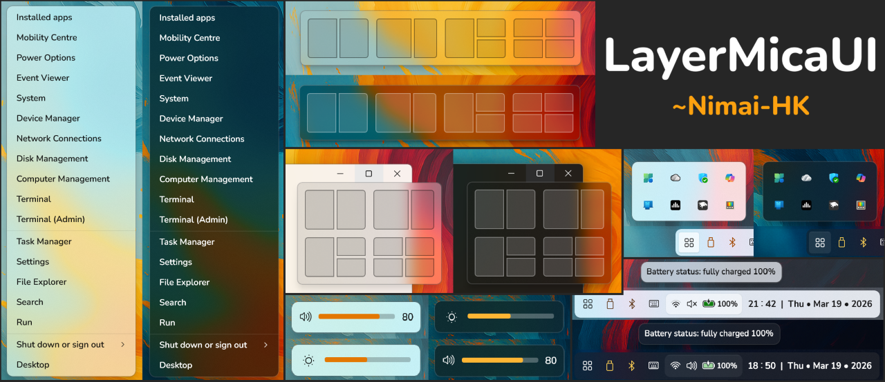
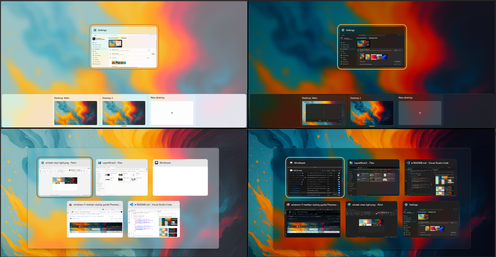
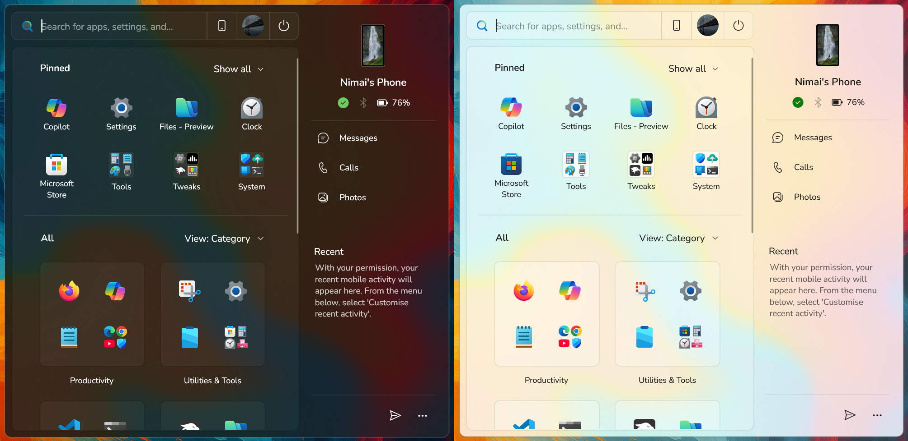
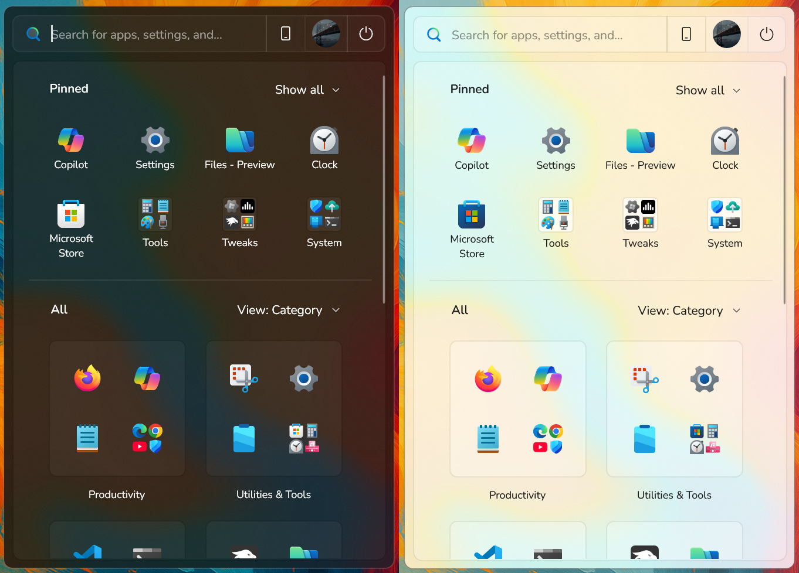
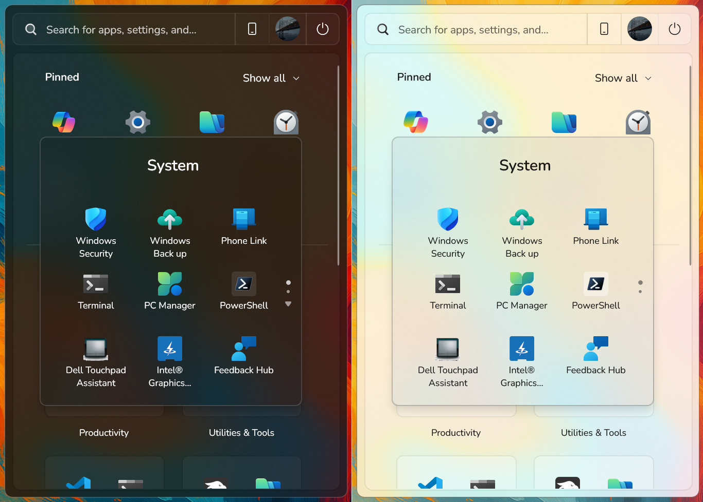
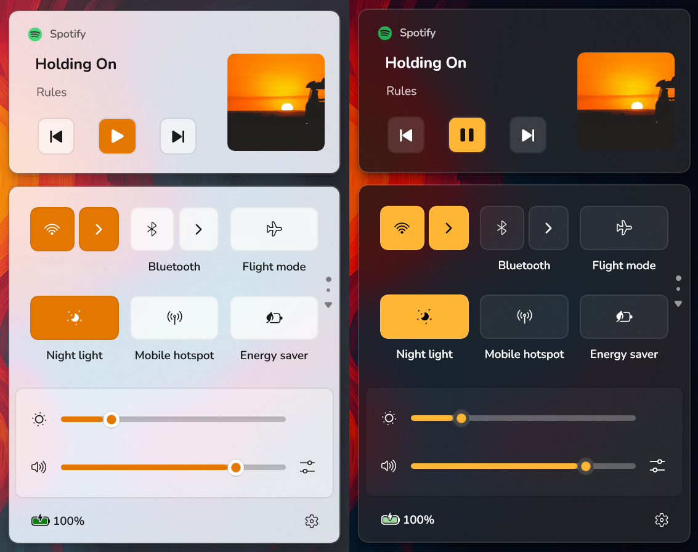
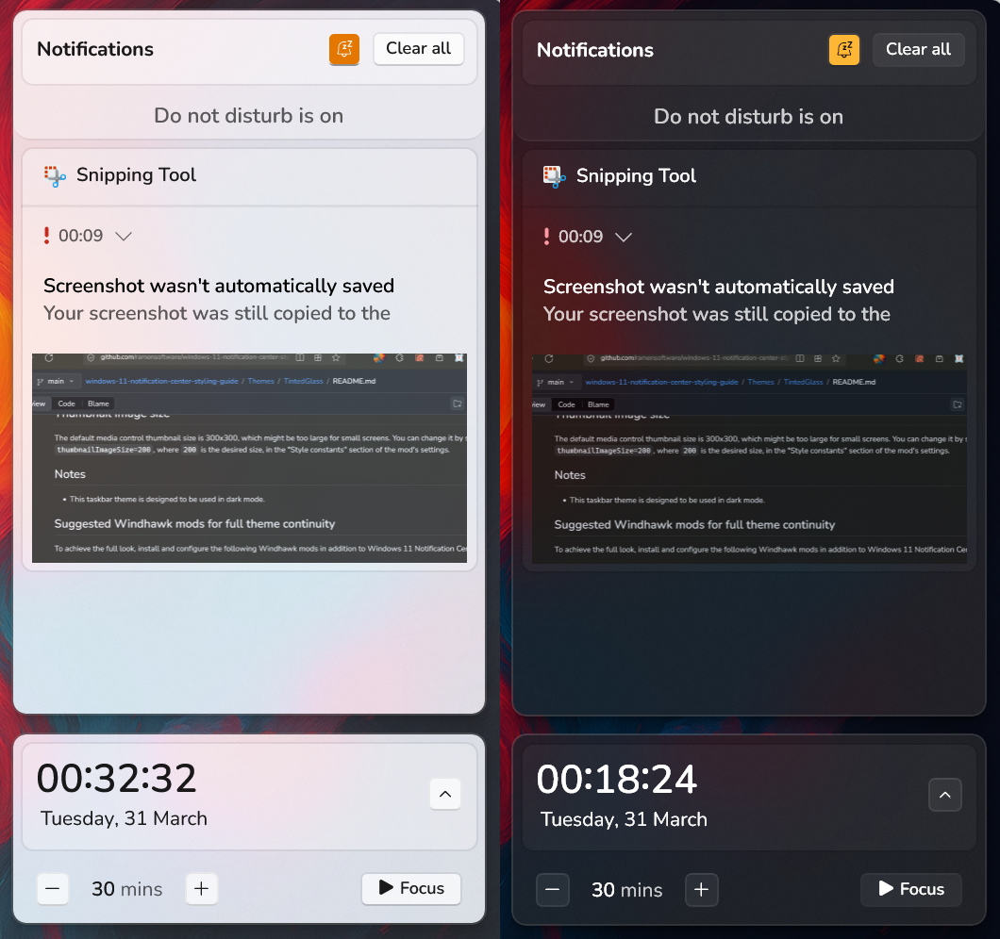

# LayerMicaUI
My Styler Themes for Windhawk Windows 11 Styling Mods

>[!NOTE]
> This repository will be completed later. For now, check out my themes in styler mods at [RamenSoftware](https://github.com/ramensoftware)

## Common Variants

### Taskbar Theme

<table style="width:100%;">
  <tr>
    <td style="height:100%; text-align:center;"></td>
    <td style="height:20%; text-align:center;"></td>
    <td style="height:100%; text-align:center;"></td>
  </tr>
</table>

### Start Menu Theme

<table style="width:100%;">
  <tr>
    <td style="height:20%; text-align:center;"></td>
    <td style="height:20%; text-align:center;"></td>
    <td style="height:20%; text-align:center;"></td>
  </tr>
</table>

### Notification Center Theme

<table style="width:100%;">
  <tr>
    <td style="height:100%; text-align:center;"></td>
    <td style="height:20%; text-align:center;"></td>
    <td style="height:100%; text-align:center;"></td>
    <td style="height:100%; text-align:center;"></td>
    <td style="height:100%; text-align:center;"></td>
  </tr>
</table>

## Personal Variants:
### Taskbar

### Start Menu
- No current personal variants.

### Notification and Control Center
- No current personal variants.

For my personalized settings, follow the guides as earlier, but use these jsons instead:

- [Taskbar](LayerMicaUI_Themes/MySettings/taskbar.json)
<!-- [Start Menu](LayerMicaUI_Themes/MySettings/startmenu.json)/>
- [Notification and Control Center](LayerMicaUI_Themes/MySettings/notifcenter.json) -->
